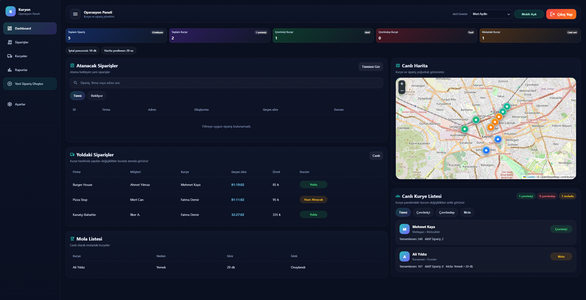
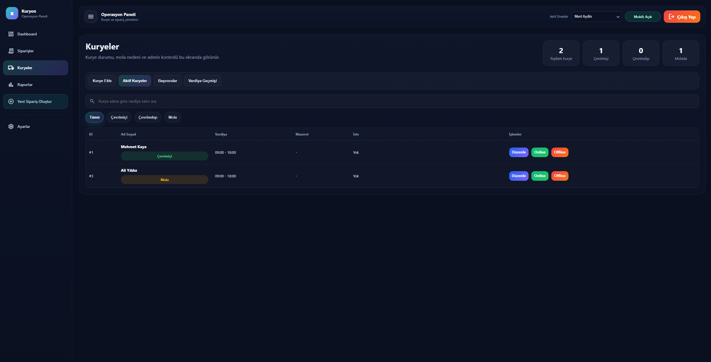
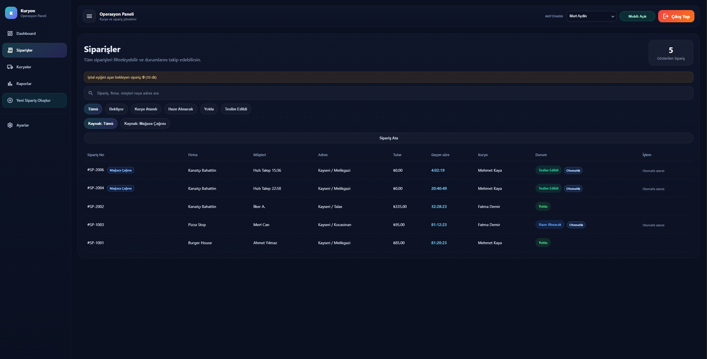
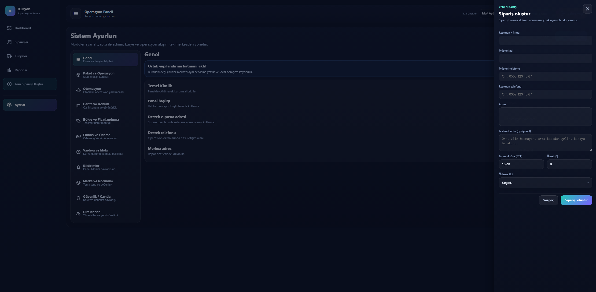
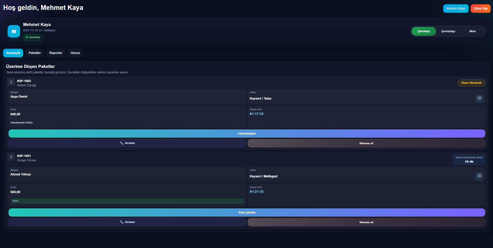
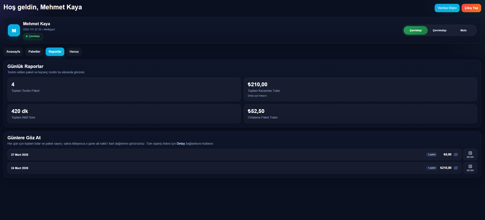

# 🚀 Kuryon – Courier Management System

Kuryon, Angular ve ASP.NET Core Web API kullanılarak geliştirilmiş bir kurye yönetim sistemidir.

## 🔧 Features

- JWT Authentication
- Role-based authorization (Admin / Courier)
- Admin panel (courier & package management)
- Courier panel (tasks, history, reports)
- SQL Server integration
- RESTful API architecture

## 🛠 Technologies

- Angular
- ASP.NET Core Web API
- SQL Server
- Entity Framework Core

## 🚀 Run (Development)

### Backend
cd backend/Kuryon.API
dotnet run

### Frontend
cd frontend/kuryon-panel
npm install
npm start

## 🔑 Test Users

Admin:
admin@test.com / 123456

Courier:
5551112233 / 123456

## 📸 Screenshots

### Admin Dashboard

### Admin Couriers

### Admin Packages

### New Orders

### Courier Dashboard

### Courier Reports

